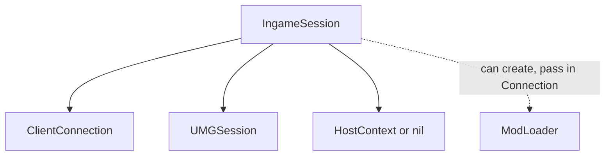
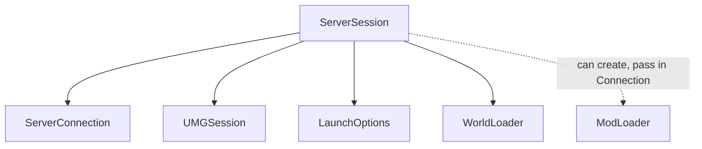
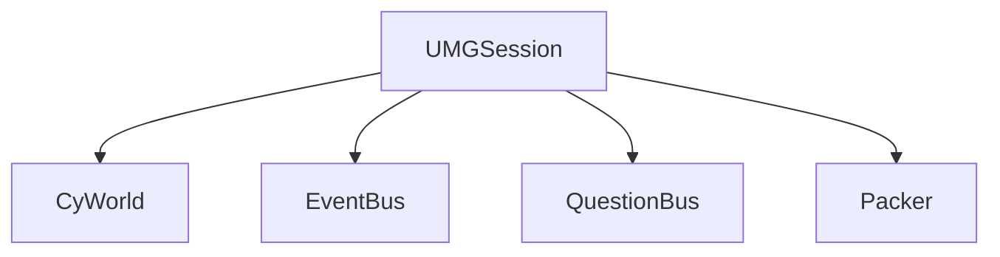
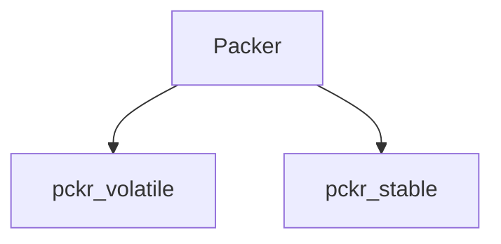
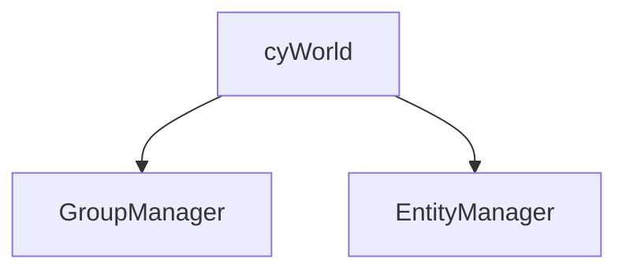
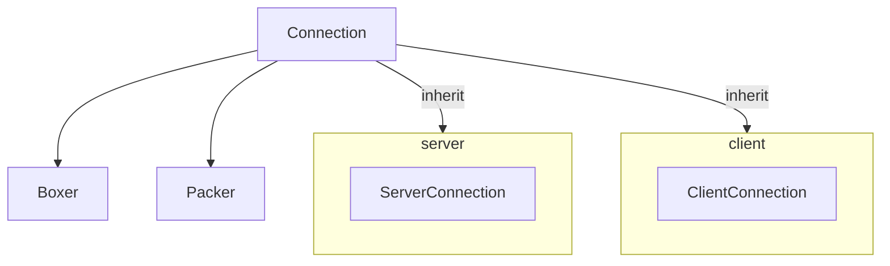
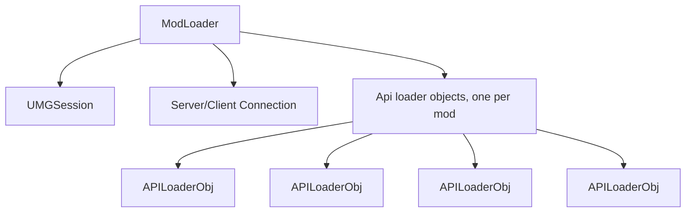

# Session architecture:

When a game is active, ALL state is encapsulated in session objects. 
There are two main ones that contain all others: 
`ServerSession` and `IngameSession`.

 
 
 

# IngameSession:
represents a game session on client-side.

---
 
 

# ServerSession:
Represents a game session on server-side.

---
 

-----
 

# UMGSessions:
UMGSessions are used on client AND server, when a game is active.  
They pretty much represent the engine context.

----
 
 
 

# Packer object:
Responsible for serializing / deserializing data. 
Also holds information about which entities have been serialized, to ensure we send by `id` when appropriate. (Previously, `entity_add_remove` was in charge of this.)

(Decouple pckr from cy. should never have been coupled in the first place.)

---
 
 
 

# Cy worlds:
Pretty self-explanatory: holds the cy ECS context. 

---
 
 
 

# Connection Objects:

 
 
 

## Modloading:
The "benefit" of globals is that we can access shit from anywhere. We need to restructure the modloader's internal loader objects a bit to compensate for our stuff no longer being global.

Each APILoaderObj needs to be able to access the `UMGSession`.

