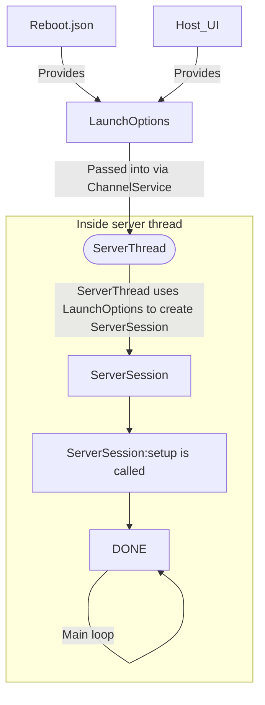
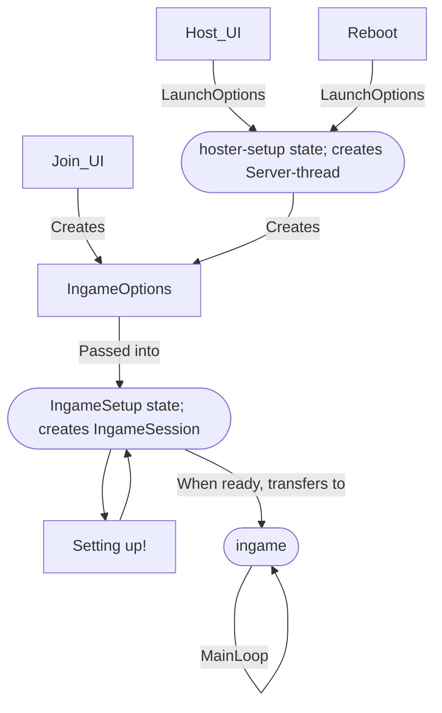
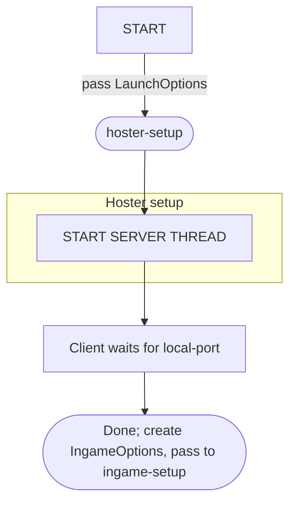
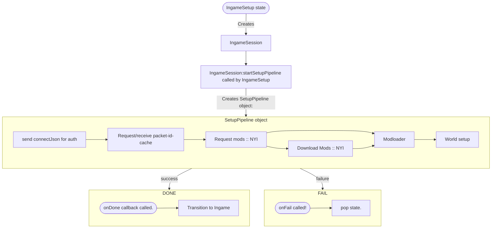

# FULL UMG SETUP PIPELINE:

Full overview of the UMG setup pipeline, 
for BOTH server AND client.

 
 
 
 

# Server launch pipeline:

(Recall that `ServerSession` contains a `UMGSession`)
 
 
 

 
 
 

----

# Ingame pipeline:

 
 
 
 
 

---

# hoster-setup state:
If hosting a server, (or offline,) goto hoster-setup

 
 
 
 

-----

Now, ingame calls a bunch of setup-actions that sets shit up.
(Ingame will pass in `IngameSession`, to each action obviously)

 
 
 
 
 
