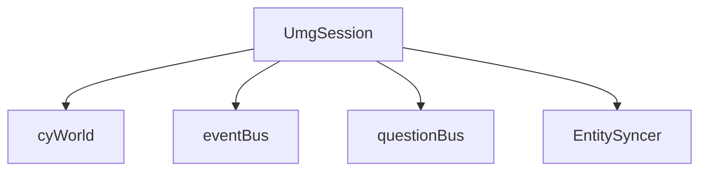
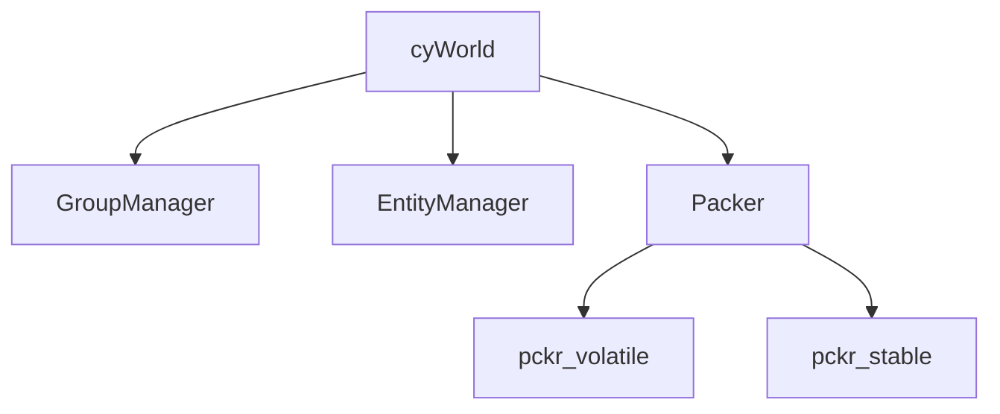
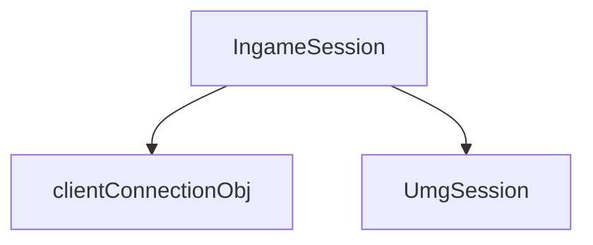
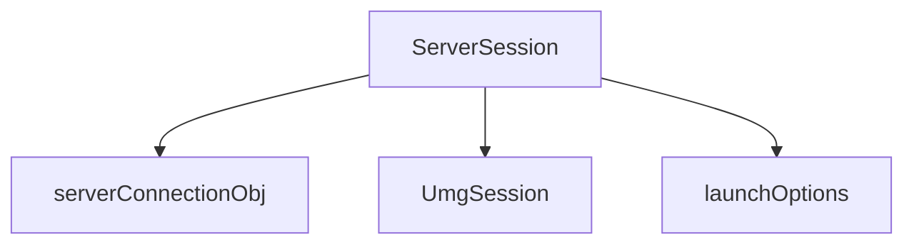
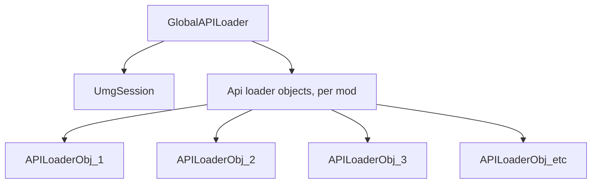

# State refactor Old diagrams:

# UMGSessions:
UMGSessions are used on client AND server, when a game is active.  
They pretty much represent the engine context.

----
 

# Cy worlds:
Pretty self-explanatory. Holds the cy ECS context. 
Note that cyWorlds also contain `pckrStates`.

---
 

# IngameSession:
represents a game session on client-side.

---
 

# ServerSession:
Represents a game session on server-side.

---
 

## Modloading:
The "benefit" of globals is that we can access shit from anywhere. We need to restructure the modloader's internal loader objects a bit to compensate for our stuff no longer being global.

Each APILoaderObj needs to be able to access the `UmgSession`.

