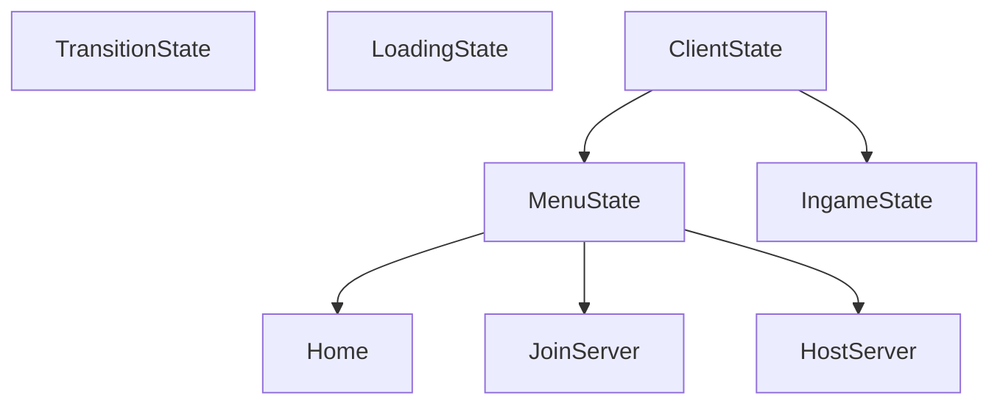

# Client state:

Contains all the possible "states" the client can be in.

For example, whether the client is in the menu,
in a game, or loading into a game.

-----

`StateClass` is the object (or metaclass)
used to represent states.

----

# Technical Explanation:

Client-state uses a stack-based state machine to work. 
States can be pushed and popped easily, and it's really clean.

---

 

 

-----

 

If a state wants to transition back to it's parent, it should simply pop itself off the stack.

Likewise, if a state wants to transition "nicely" to another state (ie. `state-X`), it can instantiate a temporary `TransitionState`, and pass in the `state-X` into the `TransitionState`'s constructor. 
Push the `TransitionState` instance onto the stack, and when the `TransitionState` is done, it will pop itself off the stack, and push `state-X`.

