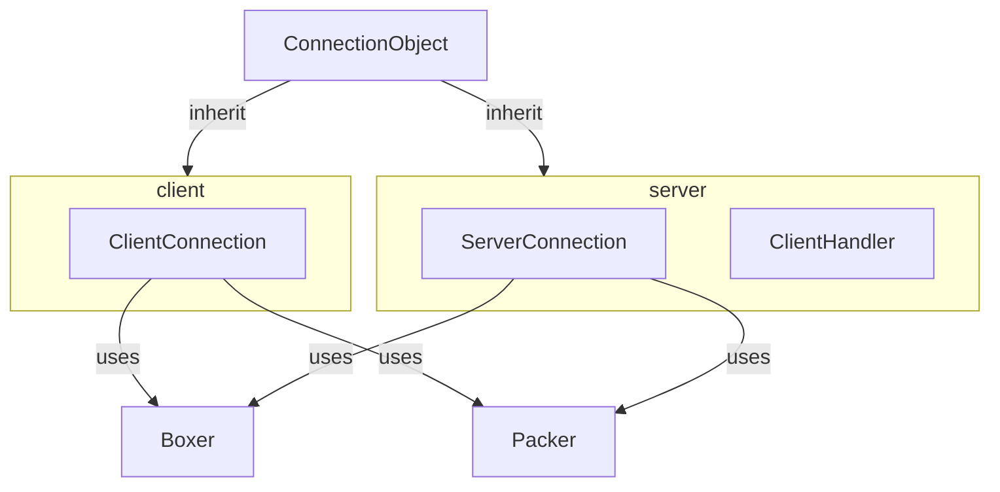

# Connection objects

Planning 4 Connection refactor. BLESH-GO!

<br/>
<br/>

# MOD API:
```lua


umg.definePacket("msg", {
    --[[
    For future: do we add a `direction` argument here?
    ie:
    direction = "clientToServer" or "serverToClient" or "bidirectional"
    ]]
    typelist = {"number", "number"}, -- types within the packet.
})


DATA_TYPES = "number" or "entity" or "string" or "boolean"


client.on("msg", func)
client.send("msg", ...)

server.on("msg", {
    handler = func,
    shouldAccept = function(sender, ...)
        return true or false -- whether should accept
    end
})
server.broadcast("msg", ...)
server.unicast(username, "msg", ...)

```

  
<br/>
<br/>
<br/>
  
  


# `Boxer` object:
Similar to `Packer`, but for PoD.
Supported data-types:
```
strings
numbers
booleans
entities <-- (implemented via strings and numbers)
```

-----
  
  

<br/>
<br/>
<br/>


# Arch-2:


<br/>
<br/>
<br/>


## Hotswappable listeners
For the setup phase, there are some few listeners that are only relevant once.
It would be really clean it we could hotswap listeners out.

### API IDEA:

```lua
connObj:setListener(newListener())
local listener = connObj:getListener() -- gets current listener

connObj:on(...) -- only applies to the current listener!!!
```

<br/>
<br/>
<br/>

## Client-setup w/ `@gimme_world`:
When mods are being loaded, the client obviously doesn't want to be receiving sync-packets.

However, it DOES want to listen to the `@world` packet; because that contains the world data.
Once the client receives the `@world` packet, it suddenly will want to receive ALL data that is being sent across the network.

We can achieve this functionality using listeners;  
create a connection-listener that only listens to `@world`.
(All other packets received will be ignored by this listener)   
Once `@world` has been received, swap to the "proper" listener.


